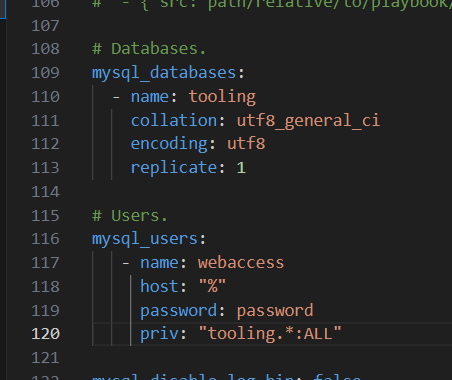
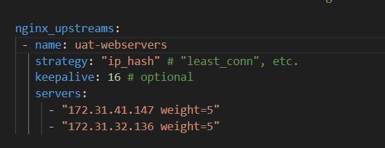
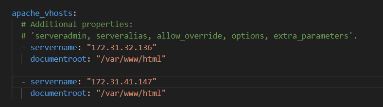

# ANSIBLE DYNAMIC ASSIGNMENTS (INCLUDE) AND COMMUNITY ROLES

1. Create new branch in git repo ansible-config-mgt and call it **dynamic-assignments**.

    - In the new branch create a new folder named `dynamic assingments`, inside it a file named `env-vars.yml` that has the following code:

        ```
        ---
        - name: collate variables from env specific file, if it exists
        hosts: all
        tasks:
            - name: looping through list of available files
            include_vars: "{{ item }}"
            with_first_found:
                - files:
                    - dev.yml
                    - stage.yml
                    - prod.yml
                    - uat.yml
                paths:
                    - "{{ playbook_dir }}/../env-vars"
            tags:
                - always
        ```

    - create a folder called **env-vars** and inside it create yaml files for each environments so `dev.yml, stage.yml, prod.yml, uat.yml `.


2. Update `site.yml` to have the following code:

    ```
    ---
     - name: Include dynamic variables 
       tasks:
        - import_playbook: ../static-assignments/common.yml 
        - include: ../dynamic-assignments/env-vars.yml
          tags:
            - always

    - name: Webserver assignment
      import_playbook: ../static-assignments/webservers.yml
    ```


3. On `Jenkins-Ansible` server install git if it is not already installed and run these codes:

        ```
        git init
        git pull https://github.com/<your-name>/ansible-config-mgt.git
        git remote add origin https://github.com/<your-name>/ansible-config-mgt.git
        git branch roles-feature
        git switch roles-feature
        ```


4. Switch to **roles** directory and download [MySQL role by geerlingguy](https://galaxy.ansible.com/geerlingguy/mysql) then it to `mysql`.

    - Edit roles configuration to use correct credentials for MySQL required for the tooling website

    
   
   - Commit and push changes

        ```
        git add .
        git commit -m "Commit new role files into GitHub"
        git push --set-upstream origin roles-feature
        ```

    - Create a Pull request and merge to `main` branch on GitHub

5. Download load balancer roles: 

    - [Nignx](https://galaxy.ansible.com/geerlingguy/nginx)

    - [Apache](https://galaxy.ansible.com/geerlingguy/apache)

    Configure each role to point traffic towards the webservers

    

    

6. Inside `defaults/main.yml` of both Nignx and Apache roles declare variable to make use of either one at a time. 

    For example for Apache you will declare

    ```
    enable_apache_lb: false
    load_balancer_is_required: false
    ```

    Do the same for Nginx but remember to change the variable name to `enable_nginx_role`.


7. Update **static-assignments** with a new `load-balancers.yml` file to reflect the new roles

    ```
    - hosts: lb
      roles:
            - { role: nginx, when: enable_nginx_lb and load_balancer_is_required }
            - { role: apache, when: enable_apache_lb and load_balancer_is_required }
    ```


8. Add this to `site.yml` inside the playbooks folder

    ```
    - name: Loadbalancers assignment
      import_playbook: ../static-assignments/loadbalancers.yml
      when: load_balancer_is_required 
    ```

9. Inside `env-vars/uat.yml` paste the following code - you can uncomment variables or switch to false depending on which load balancer you want to use 
    
    ```
    # if you want Nignx enabled

    enable_nginx_lb: true
    load_balancer_is_required: true

    #enable_apache_lb: true
    #load_balancer_is_required: true
    ```
    To test this, you can update inventory for each environment and run Ansible against each environment.